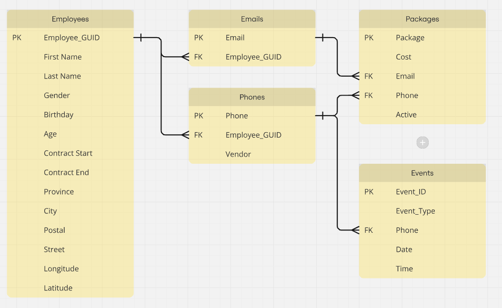

# Question 1


# Question 2
```sql
CREATE TABLE EmplpyeeData (
                              employee_guid VARCHAR(36) NOT NULL,
                              first_name VARCHAR NOT NULL,
                              last_name VARCHAR NOT NULL,
                              gender , ENUM('Male', 'Female'),
                              email VARCHAR NOT NULL,
                              age INT DEFAULT 0,
                              birthday DATE NOT NULL,
                              active BOOL DEFAULT TRUE,
                              street VARCHAR,
                              postal VARCHAR,
                              province VARCHAR,
                              city VARCHAR,
                              longitude DECIMAL,
                              latitude DECIMAL,
                              package VARCHAR,
                              vendor VARCHAR,
                              phone VARCHAR
);

BULK INSERT EmployeeData
     FROM '../EmployeeFile.csv'
     WITH (
     FEILDTERMINATOR = ',',
     ROWTERMINATOR = '\n',
     FIRSTROW = 2
     );

UPDATE EmplpyeeData SET email = REPLACE(email,
                                        SUBSTRING(email,
                                                  INSTR('@', email)+1,
                                                  INSTR('.', email)-1),
                                        'company');
```